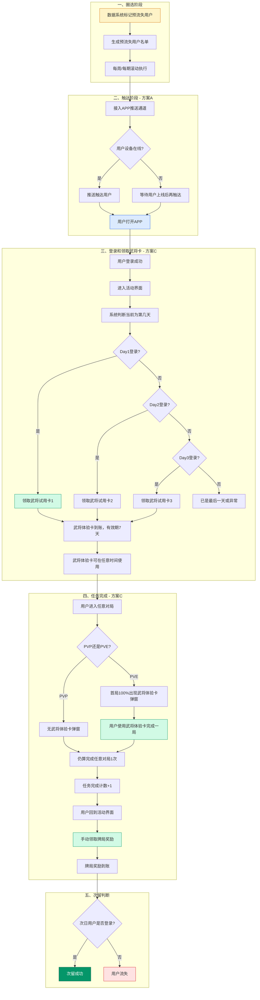
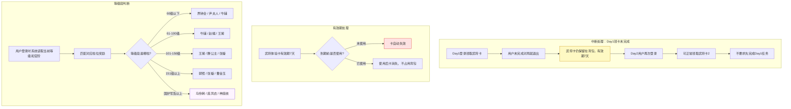

# 预流失召回链路优化 · 流程图 v1.0

> 本流程图对应方案A（扩大推送覆盖）+ 方案C（简化任务+武将体验卡激励）

---

## 1. 主流程：预流失召回链路

---

## 2. 异常分支

---

## 3. 流程节点说明

| 节点 | 类型 | 说明 |
|------|------|------|
| 圈选阶段 | 自动 | 数据系统按规则标记预流失用户，每周滚动执行 |
| 触达阶段 | 自动+手动 | 方案A：接入APP推送，覆盖50%用户 |
| 登录领取 | 手动 | 用户主动进入活动界面领取每日武将卡 |
| 任务完成 | 手动 | 方案C：只需完成任意对局1次（PVP/PVE均可） |
| 次留判断 | 自动 | 次日登录则视为留存用户 |

---

## 4. 关键设计决策

1. **中断友好**：Day1未完成不影响Day2领取，避免用户因一日中断而彻底流失
2. **体验卡7天有效期**：给用户灵活空间，不强制当日使用
3. **首局100%出现**：针对PVE局，增加武将体验卡的曝光和使用率
4. **全员统一任务**：不分官阶，统一"登录+任意对局1次"，降低低官阶用户参与门槛
5. **手动领取牌局奖励**：增加用户主动行为，提升参与感和仪式感

---

版本：v1.0 | 日期：2026-05-08 | 对应方案：方案A + 方案C
